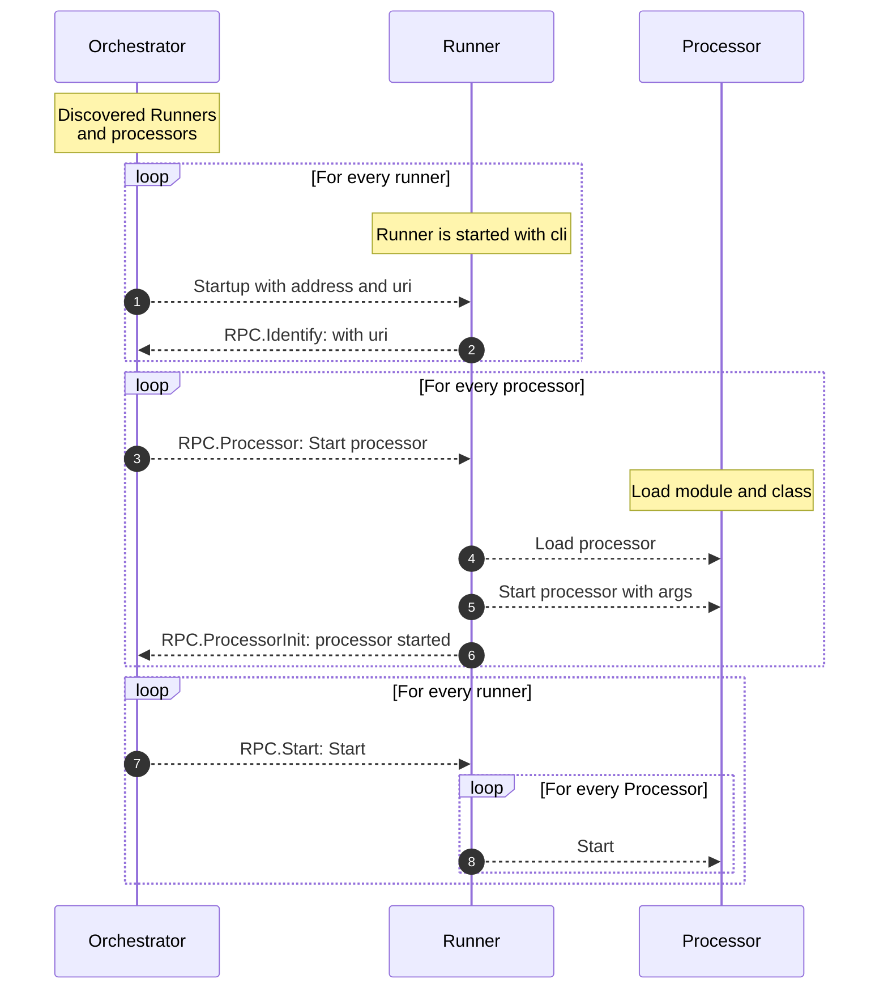
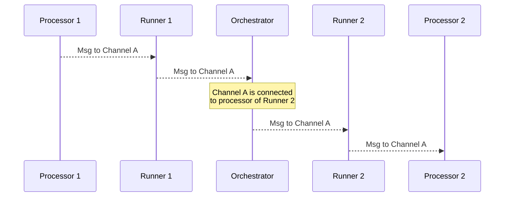
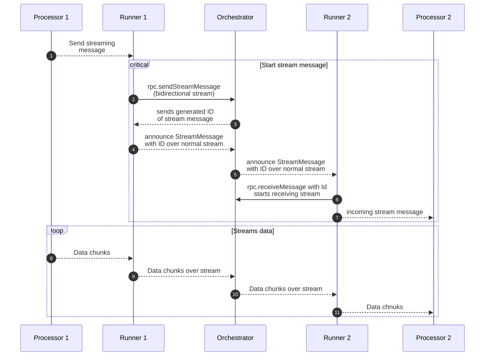

# Architecture

::: warning
This page is still under construction and will be updated soon.
:::

RDF-Connect consists of pipelines, processors, runners, and orchestrators, each playing a crucial role in the data processing ecosystem.

## Pipeline

At the heart of RDF-Connect is the notion of a ***pipeline***, which defines a structured sequence of processing steps.
Each step corresponds to a *processor*, configured with parameters and paired with an appropriate *runner* that governs its execution.
Pipelines specify the flow of data between processors using *readers* and *writers*, forming a streaming architecture in which data is continuously passed along and transformed.
The pipeline configuration itself is expressed in RDF, making it semantically explicit and machine-interpretable.

## Processor

A ***processor*** is a modular, reusable software component that performs a discrete data processing task.
In a typical scenario, a *processor* receives input data through a *reader*, transforms it according to its logic, and emits the result via a *writer*.
However, *processors* are also flexible enough to support single-directional tasks, such as those that only produce or only consume data.
Crucially, *processors* are implementation-agnostic — they can be written in any programming language and integrated into pipelines via language-specific *runners*.
This makes *processors* the building blocks of RDF-Connect’s cross-language interoperability.

## Runner

A ***runner*** is responsible for executing a *processor* on behalf of the *orchestrator*.
Each *runner* targets a specific language or execution environment, enabling *processors* written in different languages to participate seamlessly in a *pipeline*.
For example, a JavaScript processor would be executed using a `NodeRunner`, which knows how to initialize and manage JavaScript-based components.
In this sense, a *runner* serves as an execution strategy, abstracting away the platform-specific details of launching and interacting with a *processor*.

## Orchestrator

The ***orchestrator*** is the central component that interprets and runs RDF-Connect *pipelines*.
It parses the RDF-based configuration, initializes and assigns *runners*, instantiates *processors*, and manages the data flow between components.
Acting as the conductor of the system, the *orchestrator* ensures that *processors* execute in the correct order and that data is passed efficiently and correctly through the *pipeline*.
Its role is fundamental to realizing the streaming and semantic integration goals of RDF-Connect.

## Reader / Writer

*Readers* and *writers* provide the streaming interfaces that connect *processors* within a *pipeline*.
A ***writer*** streams data out from a *processor*, while a ***reader*** receives data into a *processor*.
Together, they define how data flows between pipeline steps in an idiomatic and composable way.
This separation of concerns allows for flexible data routing and makes it easy to compose and recombine processors across different pipeline configurations.

## Initialization Sequence

The initialization sequence diagram illustrates how the *orchestrator*, *runner*, and *processor* components interact during the startup phase of an RDF-Connect pipeline.
All the communication between these components is done via protocol buffers (protobuf) over gRPC, ensuring efficient and language-agnostic communication.

## Message Sequence

The message sequence diagram illustrates how messages are exchanged between *processors*, *runners*, and the *orchestrator* during the execution of a pipeline.

## Streaming Message Sequence

The streaming message sequence diagram illustrates how streaming messages are sent and received between *processors*, *runners*, and the *orchestrator* in a bidirectional stream.
This streaming model allows for continuous data flow, enabling large messages and real-time processing.

