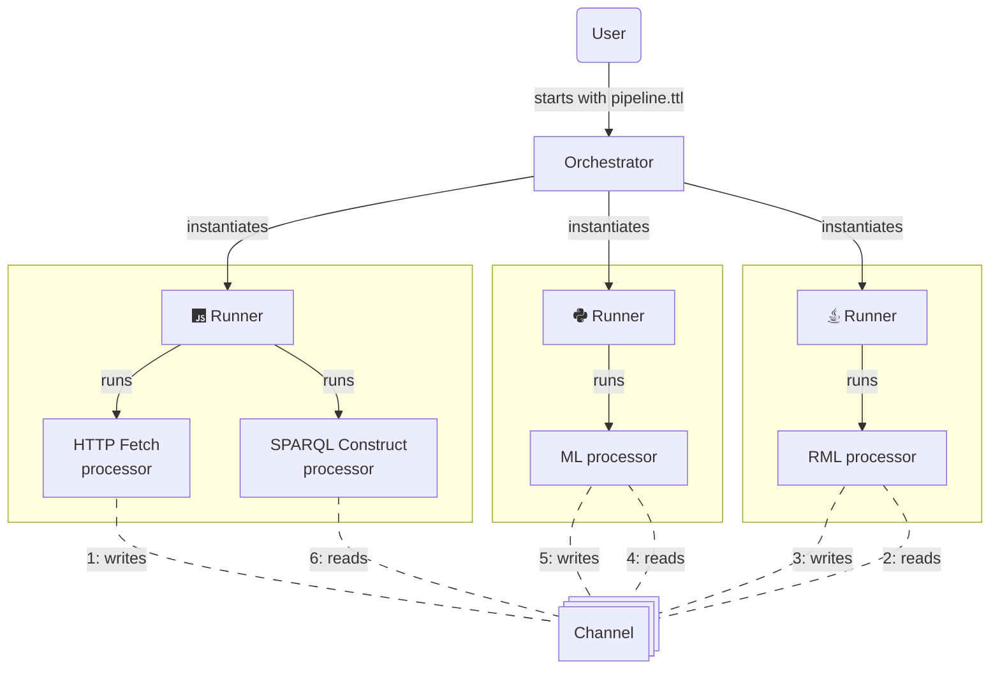

# Architecture

::: warning
This page is still under construction and will be updated soon.
:::

RDF-Connect consists of pipelines, processors, runners, orchestrators, and channels, each playing a crucial role in the data processing ecosystem.
In the diagram above, an example pipeline flow is illustrated, showing how different components interact with each other.
When a user starts a pipeline configuration file (e.g., `pipeline.ttl`), the orchestrator will be initialized.
Depending on the pipeline, the orchestrator will instantiate various runners for different environments.
An environment can differ in terms of programming language, runtime, or execution context.
For example, a processor written in JavaScript or TypeScript might be handled by a Node-based runner such as a NodeRunner or a BunRunner, depending on specific preferences or requirements.
Similarly, processors written in Java or Kotlin would require a JvmRunner to provide the appropriate runtime support.
Beyond language, environments also vary in where the runner is instantiated—some runners may operate locally on the same machine as the orchestrator, while others may be spun up on external infrastructure, such as remote servers or cloud-based services, following a platform-as-a-service model.

After the orchestrator is initialized and the runners are instantiated, the runners will start their respective processors.
Processors are the core components that perform specific data processing tasks, such as fetching data from an HTTP endpoint, executing a SPARQL query, applying machine learning algorithms, or transforming data using RML (RDF Mapping Language).
Processors can be written in various programming languages, and each processor is associated with a specific runner that is capable of executing it.

Processors communicate with each other through channels, which are streaming interfaces that allow data to flow between different processing steps.

::: details Learn more about pipelines
At the heart of RDF-Connect is the notion of a ***pipeline***, which defines a structured sequence of processing steps.
Each step corresponds to a *processor*, configured with parameters and paired with an appropriate *runner* that governs its execution.
Pipelines specify the flow of data between processors using *readers* and *writers*, forming a streaming architecture in which data is continuously passed along and transformed.
The pipeline configuration itself is expressed in RDF, making it semantically explicit and machine-interpretable.
:::

::: details Learn more about processors
A ***processor*** is a modular, reusable software component that performs a discrete data processing task.
In a typical scenario, a *processor* receives input data through a *reader*, transforms it according to its logic, and emits the result via a *writer*.
However, *processors* are also flexible enough to support single-directional tasks, such as those that only produce or only consume data.
Crucially, *processors* are implementation-agnostic — they can be written in any programming language and integrated into pipelines via language-specific *runners*.
This makes *processors* the building blocks of RDF-Connect’s cross-language interoperability.
:::

::: details Learn more about runners
A ***runner*** is responsible for executing a *processor* on behalf of the *orchestrator*.
Each *runner* targets a specific language or execution environment, enabling *processors* written in different languages to participate seamlessly in a *pipeline*.
For example, a JavaScript processor would be executed using a `NodeRunner`, which knows how to initialize and manage JavaScript-based components.
In this sense, a *runner* serves as an execution strategy, abstracting away the platform-specific details of launching and interacting with a *processor*.
:::

::: details Learn more about orchestrators
The ***orchestrator*** is the central component that interprets and runs RDF-Connect *pipelines*.
It parses the RDF-based configuration, initializes and assigns *runners*, instantiates *processors*, and manages the data flow between components.
Acting as the conductor of the system, the *orchestrator* ensures that *processors* execute in the correct order and that data is passed efficiently and correctly through the *pipeline*.
Its role is fundamental to realizing the streaming and semantic integration goals of RDF-Connect.
:::

::: details Learn more about channels
***Channels***, consisting of *readers* and *writers*, provide the streaming interfaces that connect *processors* within a *pipeline*.
A ***writer*** streams data out from a *processor*, while a ***reader*** receives data into a *processor*.
Together, they define how data flows between pipeline steps in an idiomatic and composable way.
This separation of concerns allows for flexible data routing and makes it easy to compose and recombine processors across different pipeline configurations.
:::
